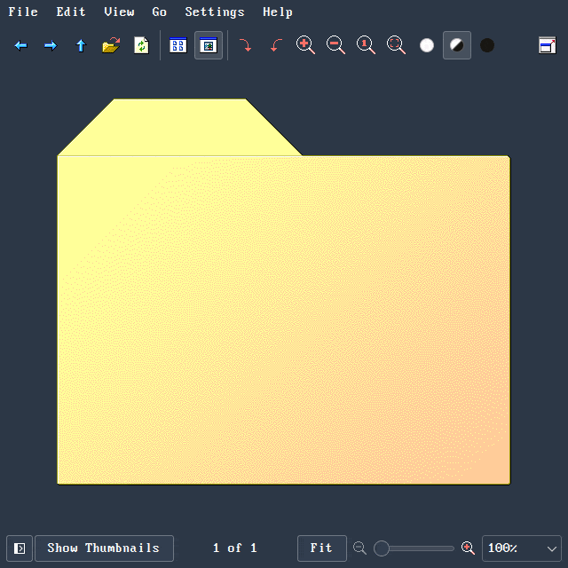

# SE98KDE
Addon for nestoris/Win98SE icon theme that follows KDE colorscheme

# Make sure to have the awesome [Win98SE icon theme](https://github.com/nestoris/Win98SE) from [Nestoris](https://github.com/nestoris) installed.

This icon theme is not meant to be used as a standalone theme. It only includes actions, everything else is inherited from Win98SE.

The original does not look good with dark themes, this one should be more "dark theme friendly". As a bonus, I replaced the blue with the current highlight color. Take a look:

Colorschemes used:
[Otto](https://gitlab.com/jomada/otto)
[Utterly Nord](https://github.com/HimDek/Utterly-Nord-Plasma)
[Gruvbox](https://store.kde.org/p/1327717)
[Matcha](https://github.com/vinceliuice/Matcha-kde)
[Qogir](https://github.com/vinceliuice/Qogir-kde)
[Materia](https://github.com/PapirusDevelopmentTeam/materia-kde)
[Reactionary](https://www.opencode.net/phob1an/reactionary)
